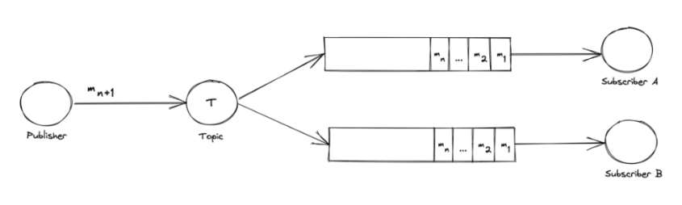

# Message Queue vs Pus/Sub

- https://www.baeldung.com/pub-sub-vs-message-queues

## Asynchronous Messaging Pattern

 확장성과 안정성, 성능 향상을 목적으로 발행자(producer)의 메시지 생성이 구독자(consumer)의 작업과 분리되는 방식

- Producer : 메시지 생성
- Consumer : 메시지를 소비

## Message Queues

- 메시지를 생성하는 발행자(Publisher)와 메시지를 보관하는 큐(Queue),  큐에서 메시지를 소비하는 여러개의 소비자(Consumer)로 구성

-  Publisher가 Consumer에게 명령을 내리는 방식으로 작동

-  Publishing 서비스는 메시지를 큐 또는 Exchange에 넣고 1개의 Consumer 서비스가 이 명령에 따른 동작으로 메시지를 소비

  

  - 왼쪽에 mn+1 메시지를 넣는 Publisher가 있음
  - 가운데에는 소비되기를 기다리는 여러 개의 메시지가 큐에 적재
  - 오른쪽에는 큐에 있는 메시지를 확인하는 Consumer A, Consumer B 서비스가 있음

  

  - 잠시 후, Consumer A가 m1 메시지를 읽음

  - **Consumer A가 소비했기 때문에 이 메시지는 Consumer B에서 소비할 수 없음**

  - 대신, Consumer B는 m2 메시지를 읽을 수 있음

- Message Queue는 메시지 처리 작업을 Consumer에게 위임. 따라서 작업이 한 번만 실행되도록 할 수 있음
- Message Queue는 MSA에서 많이 사용 됨. 클라우드 기반 또는 서버리스 애플리케이션을 개발할 때 부하에 따라 애플리케이션을 scale out/in 할 수 있음

## Pub/Sub

- 모든 구독자(Subscriber)는 발행자(Publisher)가 exchange에 전송하는 메시지 복사본을 1개 이상 가짐

  

  - Publisher는 Topic에 mn+1 메시지를 보내고 있음
  - 이 Topic은 메시지를 Subscriber에게 브로드 캐스트로 전송
  - 이 메시지들은 큐에 보내지고, 각 큐는 메시지를 listen 하고 있는 Subscriber 서비스를 가지고 있음

  

  - 잠시 후, Subscriber A, Subscriber B 둘 다  m1 메시지를 소비(consume)함
  - 또한, Topic이 새로운 메시지 mn+1을 모든 구독자에게 복사하여 분배하고 있음
  - **Pub/Sub은 모든 구독자(Subscriber)들이 메시지의 복사본을 가지도록 보증할 때 사용**

### 구독 방식

- ephemeral subscription (일시적인 구독)
  - consumer가 구동 중일때만 가능
  - consumer가 다운되면 구독과 아직 처리되지 않은 메시지가 유실됨
- durable subscription (지속적 구독)
  - 구독은 명시적으로 제거하지 않으면 계속 유지 됨
  - consumer가 다운되면 메시징 플랫폼은 구독을 유지시키고, 나중에 다시 메시징 처리가 가능

### 

## 결론

- Message Queue, Pub/Sub 모두 애플리케이션의 수평확장을 위해서 훌륭한 방법임
  - 결합도는 낮아지고, 응집도는 높아짐. 확장성도 높아짐
- 지속성(durability)이 좋음
  - Message Queue를 사용하면 consumer가 다운되더라도, 다른 consumer가 메시지를 대신 관리할 수 있음
  - Pub/Sub을 사용하면 subscriber가 다운되더라도, 손실된 메시지를 복구하면 Topic에서 사용할 수 있음
- 2개 방식 중 하나를 선택하는 핵심 기준
  - **모든 consumer들이 모든 메시지를 전부 수신해야 하는가임**